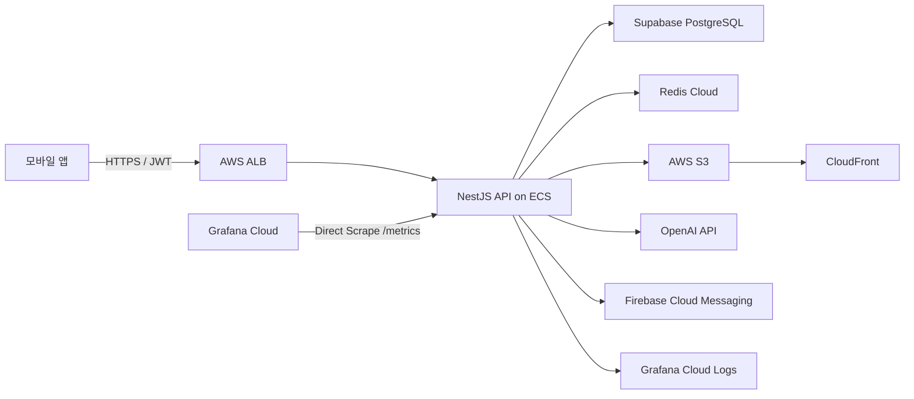
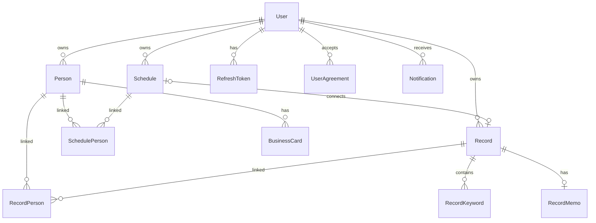

# SWYP App 5기 7팀 Backend

> 사람, 일정, 대화 기록을 연결해 관계 관리를 돕는 모바일 애플리케이션의 백엔드 API

---

## 📌 프로젝트 한 줄 요약

연락처와 명함으로 인물을 관리하고, 인물과 연결된 일정 및 텍스트·음성 기록을 한곳에서 관리하는 **개인 관계 관리 서비스의 NestJS 백엔드**입니다.

---

## 🔗 서비스 링크

- API: https://api.talkertive.co.kr
- Swagger: https://api.talkertive.co.kr/docs

---

## ✨ 주요 기능

### 인증 및 계정

- Google ID Token 검증 후 자체 Access/Refresh Token 발급
- Refresh Token 원문 대신 SHA-256 해시 저장 및 토큰 회전
- Redis의 활성 세션과 JWT `familyId`를 대조하는 단일 기기 로그인 정책
- 로그아웃, 토큰 갱신, Google 재인증 기반 계정 삭제

### 약관 및 개인정보 보호

- 버전별 약관 문서와 동의·철회 이력 관리
- 필수 약관 미동의 사용자를 API Guard에서 차단
- 이메일·전화번호 등 개인정보 암호화 및 검색용 해시 분리 저장

### 인물 관리

- 기기 연락처의 이름·전화번호 일괄 가져오기
- 인물 기본 정보, 중요 인물, 직군·회사·직책·관계 관리
- 추가 연락처, 프로필 이미지, 명함 앞·뒷면 이미지 등록
- 사용자 소유권을 포함한 복합 FK로 다른 사용자의 데이터 참조 차단

### 일정 및 기록

- 인물 및 기록과 연결된 일정 생성·조회·수정·삭제
- 텍스트 기록 작성과 북마크, 연결 인물 및 일정 관리
- 음성 파일 업로드 후 비동기 STT 작업 생성 및 상태 조회
- OpenAI API를 이용한 음성 전사, 요약 및 핵심 키워드 추출
- AWS S3에 원본 파일을 저장하고 CloudFront Signed URL로 제한적 접근 제공

### 알림 및 홈

- Firebase Cloud Messaging 푸시 토큰 관리
- DB 기반 알림 작업 큐와 매분 실행되는 발송 워커
- 중복 방지 키를 이용한 멱등 처리 및 생일 알림 자동 재예약
- 예정 일정, 중요 인물, 최근 기록을 조합한 홈 화면 데이터 제공

### 요금제

- Basic, Pro, Premium 요금제 카탈로그 제공
- 인물 수, 음성 저장 용량, 월 가격 등 요금제별 정책 관리
- Google Play 구독 상태를 사용자 요금제로 해석하는 기반 구조

---

## 🛠️ 기술 스택

| 분류 | 기술 |
|---|---|
| Framework | NestJS 11, Express |
| Language | TypeScript 5 |
| Database | PostgreSQL, Prisma 6, `@prisma/adapter-pg` |
| Auth | Google OAuth ID Token, Passport JWT, 자체 Refresh Token |
| Session / Cache | Redis, ioredis |
| Storage | AWS S3, CloudFront Signed URL |
| AI | OpenAI HTTP API (음성 전사·요약·키워드 추출) |
| Push | Firebase Cloud Messaging |
| API Docs | Swagger / OpenAPI |
| Observability | Prometheus, Grafana Cloud, Loki, Winston |
| Infrastructure | Docker, AWS ECR·ECS Fargate·ALB, Supabase, Redis Cloud |
| CI/CD | GitHub Actions, AWS OIDC |

---

## 🏗️ 아키텍처



- ALB에서 TLS를 종료하고 ECS 컨테이너의 `3000` 포트로 요청을 전달합니다.
- 애플리케이션 로그는 Loki로 전송하고, Grafana Cloud가 `/metrics`를 직접 수집합니다.
- 컨테이너 시작 시 Prisma migration을 적용한 뒤 NestJS 서버를 실행합니다.

---

## 📁 프로젝트 구조

```text
SWYP-app5-backend/
├── backend/
│   ├── prisma/                 # Prisma 스키마와 migration
│   ├── scripts/                # 개인정보 암호화 backfill 스크립트
│   └── src/
│       ├── agreements/         # 약관 문서·동의 및 필수 약관 Guard
│       ├── auth/               # Google 로그인, JWT, 세션, 계정
│       ├── billing/            # 구독 상태 기반 요금제 판정
│       ├── common/             # 로깅, 메트릭, 공통 관측성
│       ├── home/               # 홈 화면 집계
│       ├── notifications/      # FCM, 알림, DB 작업 큐
│       ├── people/             # 인물·명함·연락처 관리
│       ├── plans/              # 요금제 카탈로그
│       ├── privacy/            # 개인정보 암호화
│       ├── record/             # 텍스트·음성 기록, STT·요약
│       ├── redis/              # 세션용 Redis 연결
│       ├── s3/                 # 미디어 저장 및 Signed URL
│       ├── schedule/           # 일정과 인물·기록 연결
│       └── users/              # 마이페이지와 사용자 정보
├── .github/workflows/ci.yml    # 테스트, 빌드, ECS 배포
└── docker-compose.prod.yml     # 프로덕션 이미지 로컬 구동
```

---

## 🗄️ 핵심 도메인 모델



- `Record`는 `TEXT`와 `VOICE` 타입을 하나의 모델로 관리합니다.
- `Person`, `Record`, `Schedule` 간 연결로 특정 인물의 일정과 대화 기록을 함께 조회할 수 있습니다.
- 소유권이 필요한 관계는 `userId`가 포함된 복합 키로 보호합니다.

---

## ⚡ 주요 API

| 영역 | 엔드포인트 | 설명 |
|---|---|---|
| 인증 | `POST /auth/google` | Google ID Token 로그인 |
| 인증 | `POST /auth/refresh` | Access/Refresh Token 갱신 |
| 약관 | `GET /agreements` | 현재 적용 약관 조회 |
| 홈 | `GET /home` | 일정·중요 인물·최근 기록 조회 |
| 인물 | `POST /people/import` | 기기 연락처 일괄 등록 |
| 인물 | `GET /people` | 인물 목록 조회 |
| 일정 | `POST /schedule` | 일정 생성 |
| 일정 | `GET /schedule` | 일정 목록 조회 |
| 기록 | `POST /record/text` | 텍스트 기록 생성 |
| 기록 | `POST /record/voice/stt` | 음성 STT 작업 생성 |
| 알림 | `GET /notifications` | 알림 목록 조회 |
| 요금제 | `GET /plans` | 요금제 카탈로그 조회 |

전체 요청·응답 스키마와 인증 방법은 Swagger의 `/docs`에서 확인할 수 있습니다.

---

## 🚨 트러블슈팅 및 설계 고민

### 1) 단일 기기 세션 보장

- **문제**: 유효한 JWT는 새 기기 로그인 이후에도 만료 전까지 사용할 수 있습니다.
- **해결**: JWT에 Refresh Token family ID를 포함하고, 매 요청마다 Redis의 활성 family ID와 비교해 이전 기기의 세션을 즉시 무효화합니다.

### 2) 사용자 간 데이터 격리

- **문제**: 서비스 계층의 조건 누락만으로 다른 사용자의 인물이나 기록을 연결할 위험이 있습니다.
- **해결**: `id + userId` 복합 unique key와 복합 FK를 사용해 소유권을 데이터베이스 스키마에서도 강제합니다.

### 3) 음성 처리의 긴 응답 시간

- **문제**: 파일 업로드, STT, 요약을 하나의 HTTP 요청에서 완료하면 타임아웃과 재시도 문제가 커집니다.
- **해결**: 음성 작업을 별도 job으로 생성하고 클라이언트가 상태를 조회하도록 분리했습니다. 작업 상태와 생성된 기록 ID를 DB에 보존합니다.

### 4) 미디어 접근 제어

- **문제**: S3 객체의 공개 URL은 개인정보가 포함된 프로필·명함·음성 파일을 영구 노출할 수 있습니다.
- **해결**: S3는 비공개로 유지하고, 애플리케이션에서 만료 시간이 있는 CloudFront Signed URL을 발급합니다.

### 5) 알림 중복 방지

- **문제**: 워커 재시도나 반복 실행으로 같은 푸시가 여러 번 발송될 수 있습니다.
- **해결**: 사용자별 `dedupeKey` unique 제약과 작업 상태를 사용해 멱등성을 확보하고, 성공한 반복 알림만 다음 발송 시점으로 재예약합니다.

---

## 🚀 로컬 실행

### 사전 요구사항

- Node.js 22
- pnpm 10.28.2
- PostgreSQL
- Redis (선택, 미설정 시 비활성화)

### 설치 및 실행

```bash
cd backend
pnpm install
pnpm prisma generate
pnpm prisma migrate dev
pnpm start:dev
```

기본 서버 주소는 `http://localhost:3000`, Swagger 주소는 `http://localhost:3000/docs`입니다.

### 주요 환경 변수

| 분류 | 변수 |
|---|---|
| Database | `DATABASE_URL`, `DIRECT_URL` |
| Auth | `JWT_ACCESS_SECRET`, `JWT_ACCESS_EXPIRES_IN`, `REFRESH_TOKEN_EXPIRES_DAYS` |
| Google | `GOOGLE_CLIENT_ID`, `GOOGLE_IOS_CLIENT_ID`, `GOOGLE_ANDROID_CLIENT_ID` |
| Redis | `REDIS_URL` |
| Storage | `AWS_REGION`, `AWS_ACCESS_KEY_ID`, `AWS_SECRET_ACCESS_KEY`, `AWS_S3_BUCKET_NAME` |
| CloudFront | `CLOUDFRONT_DOMAIN`, `CLOUDFRONT_KEY_PAIR_ID`, `CLOUDFRONT_PRIVATE_KEY` |
| Firebase | `FIREBASE_SERVICE_ACCOUNT_JSON` |
| OpenAI | `OPENAI_API_KEY`, `OPENAI_TRANSCRIPTION_MODEL`, `OPENAI_SUMMARY_MODEL` |
| Monitoring | `METRICS_USERNAME`, `METRICS_PASSWORD`, `LOKI_URL`, `LOKI_USERNAME`, `LOKI_PASSWORD` |

환경 변수의 실제 값과 서비스 계정 키는 저장소에 커밋하지 않습니다.

---

## ✅ 품질 확인

```bash
cd backend
pnpm exec eslint "{src,test}/**/*.ts"
pnpm exec tsc --noEmit
pnpm test
pnpm build
```

GitHub Actions는 Pull Request에서 lint, 타입 검사, 단위 테스트, 빌드를 수행합니다. `main` 브랜치에 push되면 Docker 이미지를 ECR에 올리고 ECS 서비스를 롤링 배포합니다.
